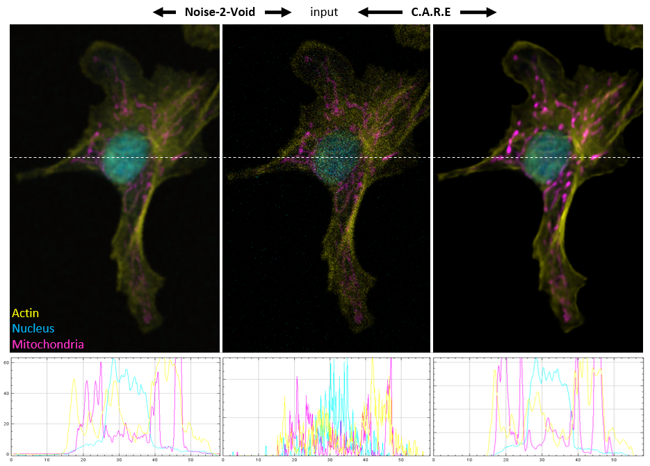

# CARE-*less* care|n2v
---
Simple IPython based user interface to [CARE](http://csbdeep.bioimagecomputing.com/) a toolbox for Content-aware Image Restoration and to [Noise2Void](https://github.com/juglab/n2v) a self-supervised deep learning based denoising.

# Installation (care and n2v)
---
We strongly recommend using the [Anaconda Python distribution (64bit)](https://www.anaconda.com/distribution/) with Python == 3.9. Furthermore, we recommend to create a new conda virtual environment.

You can install CAREless and dependencies into a new conda environment by:

```
conda env create -f environment.yml
conda activate careless
```

## Windows 
You will need to install the *Microsoft Visual Studio C++ Build Tools* and the *Windows 10 SDK* prior to the conda installation. In the Visual Studio (Community) installer, select individual components and check

* MSVC v143 - VS 2022 C++ x64/x86 build tool...
* Windows 10 SDK (10.0.20348.0)

## Linux 

You might have to set:

`export LD_LIBRARY_PATH=$LD_LIBRARY_PATH:$CONDA_PREFIX/lib/`

Verify the installation by:

`python3 -c "import tensorflow as tf; print(tf.config.list_physical_devices('GPU'))"`

# How to use:
---
## CARE
CARE needs pairs of registered images - low (input) and high (output) quality. It trains a convolutional neural network how to transform low quality images - which might even be of less physical resolution - into high quality images. After training, newly recorded low quality images or movies can be predicted. 2D, 3D and multi-channel images are supported. For each channel a separate network is trained.

### Vanilla screencast for input selection and training
[CAREless user interface](vid/bif_care_demo_01.mp4)

### Input selection and patch extraction
0. Clone this repository with `git clone https://github.com/sommerc/careless`
1. Copy and rename the IPython notebook template file: `careless_care.ipynb` to `my_care_project.ipynb`
2. Open your renamed `my_care_project.ipynb` file in Jupyter Lab.
3. In order to train CARE, the path to the image pairs needs to be specified. Then, choose images for low and high quality respectively using a wild-card (e.g. `low*.tif` and `high*.tif`). The images will be converted and image patches are extracted. This step is required for efficient GPU execution. Choose patch sizes for your input dimensions `(Z)YX` and set how many patches should be extracted per image pair. After image patches have been extracted, they are saved to the output directory.

### Training the network
The training of a neural network is done iteratively in `epochs`. In each epoch, the network weights' are updated by optimizing a loss function on `steps_per_epoch` batches of image patches. The size of the batches is given by `batch_size`. To make use of all your image data, select `steps_per_epoch = #patches / batch_size`. Per default, 10% of patches are used for validation and not used in training.

4. Select training parameters and execute training code block.


## Noise2Void

Noise2void does not require pairs of images.
1. Copy and rename the IPython notebook template file: `careless_n2v.ipynb` to `my_n2v_project.ipynb`
2. Open your renamed `my_n2v_project.ipynb` file in Jupyter Lab.
3. Follow steps in the notebook

# Example data
The authors of [CARE](https://github.com/CSBDeep/CSBDeep/tree/master/examples) provide example data from different modalities.

* [3D denoising](http://csbdeep.bioimagecomputing.com/example_data/tribolium.zip)

Unzip, copy and rename (e. g. *_low.tif*, *_high.tif*) the images form `low` and `GT` into a single folder.

# Comparison of CARE with N2V



